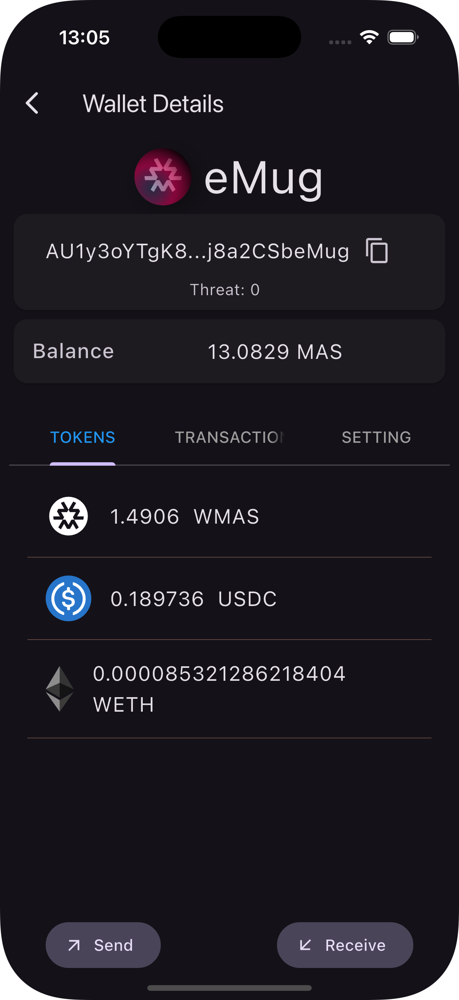
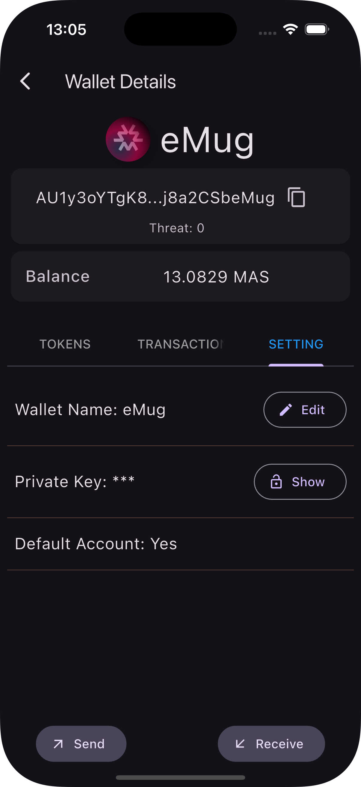
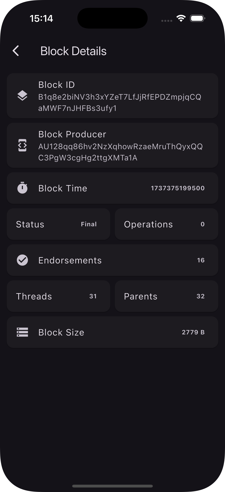

<div align="center">
  
</div>

# MicroGate (μG)
[![Stars][stars-shield]][stars-url]
[![Issues][issues-shield]][issues-url]
[![MIT License][license-shield]][license-url]


## Introduction
Massa Universal Mobile Gateway, abbreviated as (MUG) and hence resulting in the name microgateway -  abbreviated at (μG), is a universal mobile gatway for Massa Blockchain. The icon for the app is designed to reflect this.

## Features
MicroGate will initally have the following features:

### Massa Wallet
- Massa wallet  - with ability to create multiple wallets, restore wallet from private key, export wallet, send and receive transactions.
### Dusa DEX
- Dusa Integration - with ability to wrap Massa tokens, swap token between MAS and USDC, swap token between MASSA and WETH.
### Massa Explore
- Massa explorer - with ability to list all massa addresses, search for an address, and view address details.


## Development Status
### Massa wallet
- [x] Create wallet
- [x] Store wallet in secure storage
- [x] View wallet details
- [x] Restore wallet from private key
- [x] Export wallet private key and as QR code
- [x] Send transaction from one address to another
- [x] Receive transaction
### Dusa Dex
- [x] Wrap MAS to WMAS
- [x] Unwrap WMAS to MAS
- [x] Swap MAS to USDC.e
- [x] Swap USDC.e to MAS
- [x] Swap MAS to WETH
- [x] Swap WETH to MAS
### Massa explorer
- [x] List all staking addreses
- [x] Search for an address
- [x] View address details
- [x] Search for domain name
- [x] View  domain name details
- [x] Purchase a domain name if available
- [x] Search for operation
- [x] View  view operation details
- [x] Search for block
- [x] View  view block details


## Usage Instructions

### Initial setup and login

Follow these steps to complete the initial setup:

| Step 1: Passphrase setup | Step 2: Login | Step 3: Wallet homepage |
|---|---|---|
|  |  |  |
|**Screen 1**. Enter your passphrase and its confirmation| **Screen 2**. Enter passphrase to login. | **Screen 3**. The default wallet account is created and displayed on wallet homepage |

### MASA Wallet - Import and create wallet

Follow these steps to import an existing wallet or create a new one:

| Step 1: Import wallet | Step 2: Create wallet | Step 3: Wallet homepage |
|---|---|---|
|  |  |  |
|**Screen 4**. Paste the wallet private key. The imported wallet key is encrypted and added to the list of wallets|**Screen 5**. Create New wallet, creates a new wallet and store it securely | **Screen 6**. The second wallet in the lis is imported and the third one is created|

### MASA Wallet - Wallet Details

Follow these steps to view more information about your wallet:

| Step 1: Wallet Tokens | Step 2: Wallet Transactions | Step 3: Wallet Settings |
|---|---|---|
|  |  |  |
|**Screen 7**. List of tokens associated with the wallet |**Screen 8**. List of transactions |**Screen 9**. Wallet settings where you can edit wallet name, show the wallet private key and set the wallet as default wallet|

### MASA Wallet - Send and Receive coins

Follow these steps to to send and receive tokens:

| Step 1: Transfer MAS | Step 2: Transaction Confirmation | Step 3: Receive MAS|
|---|---|---|
|  |  |  |
|**Screen 10**. Past the recipent address or select from the list of addresses and enter the amount you want to transfer |**Screen 11**. This is a summary of the transaction |**Screen 12**. You can scan the address to receive to receive token|

### Dusa DEX - Swap tokens

Follow these steps to to swap tokens using dusa decentralised exchange:

| Step 1: List of tokens | Step 2: Swap| Step 3: Confirmation|
|---|---|---|
|  |  |  |
|**Screen 13**. Currently supported tokens are MAS, WMAS, USDC and WETH |**Screen 14**. Enter the amount and token you want to swap from |**Screen 15**. Confirmation after swaping|

### Massa Explorer - Search Address

Follow these steps to search for the address:

| Step 1: Explorer Homepage| Step 2: Search Address | Step 3: Address details|
|---|---|---|
|  |  |  |
|**Screen 16**. Explorer homepage with search bar|**Screen 17**. Search an address |**Screen 18**. View details of the searched address|

### Massa Explorer - Search Block

Follow these steps to search for block using block hash:

| Step 1: Explorer Homepage| Step 2: Search Block | Step 3: Block details|
|---|---|---|
|  |  |  |
|**Screen 19**. Explorer homepage with search bar|**Screen 20**. Search a block with block hash |**Screen 21**. View details of the searched block|

### Massa Explorer - Search Operation

Follow these steps to search for an operation using the operation hash:

| Step 1: Explorer Homepage| Step 2: Search Operation | Step 3: Operation details|
|---|---|---|
|  |  |  |
|**Screen 22**. Explorer homepage with search bar|**Screen 23**. Search an operation using operation hash |**Screen 24**. View details of an operation|

### Massa Explorer - Search Domain

Follow these steps to search for a domain name:

| Step 1: Explorer Homepage| Step 2: Search Domain | Step 3: Domain details|
|---|---|---|
|  |  |  |
|**Screen 25**. Explorer homepage with search bar|**Screen 26**. Search a domain name. A domain name must end with .massa, e.g `deweb.massa` |**Screen 27**. View details of a domain name|

### Massa Explorer - Buy Domain
If the domain is not found, it likely that it is not yet purchase and you can purchase and own it. Follow these steps to purchase a domain.

| Step 1: Search for domain| Step 2: Search Domain | Step 3: Domain details|
|---|---|---|
|  |  |  |
|**Screen 28**. Search for the damain|**Screen 29**. Shows the details of the doamin that does not exist, e.g `ilovemassa.massa`. Click `Buy` to purchase it **Screen 30**.| Domain purchase confirmation|

### Others

This app supports other functionalies as detailed below:

| Login attempts| Timeout | Settings|
|---|---|---|
|  |  |  |
|**Screen 31**. The app restricts the number of login attempts to 3. If exceeded, it will disable the apply for a certain duration before it allows you to login again|**Screen 32**. The app will automatically logout you out for a certain duration of inactivity |**Screen 33**. The app has settings provision|


## Testing Flutter App

Follow the steps below to set up and test the Flutter app on your computer:

---

### Prerequisites

1. **Install Flutter SDK**  
   Download and install the [Flutter SDK](https://docs.flutter.dev/get-started/install) for your operating system. Follow the installation guide specific to your platform (macOS, Linux, or Windows).

2. **Set Up Emulators/Simulators**  
   - **Android**: Install the [Android Emulator](https://developer.android.com/studio/run/emulator). You can set it up via Android Studio by adding an emulator in the AVD Manager.  
   - **iOS** (macOS only): Install Xcode and set up the [iOS Simulator](https://developer.apple.com/documentation/safari-developer-tools/installing-xcode-and-simulators).

3. **Install a Code Editor (Optional)**  
   Install [Visual Studio Code](https://code.visualstudio.com/) for an optimized development and testing experience. You may also install Flutter and Dart extensions for better support.

---

   ### Steps to Test the App

1. **Clone the Repository**  
   Clone the project to your local machine:
   ```bash
   git clone git@github.com:nafsilabs/mug.git
   cd mug

2. **Install Dependencies**  
   Navigate to the app's root folder and run the following command to install all required packages:
   ```bash
   flutter pub get

3. **Install Dependencies**  
   Launch an Emulator/Simulator
     * **Android**: Start the Android Emulator via Android Studio or the flutter emulators command.
     * **iOS**: Open Xcode and launch the iOS Simulator.

4. **Verify Device Detection**  
   Check if Flutter has detected the connected devices or emulators:
    ```bash
    flutter devices

5. **Run the App**
   Launch the app by specifying the device identifier obtained in the previous step:  
    ```bash
    flutter run -d <device-id>
   Replace <device-id> with the actual emulator or physical device identifier.

6. **Start Testing**
   The app will launch on the selected device/emulator. You can now interact with and test the app's features.

### Building the App for Android and iOS

Follow these steps to build the app for Android and iOS:

#### Building for Android
1. **Generate the APK**  
   Run the following command to build the APK:
   ```bash
   flutter build apk --release
   ```
   The generated APK will be located in the `build/app/outputs/flutter-apk/` directory.

2. **Generate the App Bundle**  
   To upload the app to the Google Play Store, build an Android App Bundle (AAB):
   ```bash
   flutter build appbundle --release
   ```
   The generated AAB will be located in the `build/app/outputs/bundle/release/` directory.

3. **Sign the APK/AAB**  
   Ensure the APK or AAB is signed with your release key. Follow the [official Flutter guide](https://docs.flutter.dev/deployment/android) for signing and publishing.

#### Building for iOS
1. **Set Up Xcode**  
   Open the project in Xcode:
   ```bash
   open ios/Runner.xcworkspace
   ```

2. **Select a Build Target**  
   In Xcode, select your desired device or simulator as the build target.

3. **Build the App**  
   Build the app by selecting `Product > Archive` from the Xcode menu.

4. **Sign and Distribute**  
   Use Xcode's interface to sign the app with your Apple Developer account and distribute it via TestFlight or the App Store. Follow the [official Flutter guide](https://docs.flutter.dev/deployment/ios) for detailed instructions.


## Additional information
You can get more information about massa by visiting the links below.
### Links
- [Massa: Massa main website](https://massa.net)
- [Massa Foundation website](https://massa.foundation)
- [Massa buildnet](https://buildnet.massa.net)
- [Massa station](https://station.massa.net/)
- [Massa Documentation: Valuable massa documentation](https://docs.massa.net/)
- [Massa Github: Massa official github repository](https://github.com/massalabs)
- [Massa Web3: massa-dart will have similar functionalities as massa-web3](https://github.com/massalabs/massa-web3)
- [Massa Dart SDK repository](https://github.com/nafsilabs/massa-dart)
- [Massa Dart SDK documentation](https://pub.dev/documentation/massa/latest/massa/massa-library.html)

### Support
This project is supported by [Massa Foundation Grant](https://massa.foundation)

### Contribute
You can contribute to this package, request new features or report any bug by visiting the package repository at [mug](https://github.com/nafsilabs/mug)


## License

The MIT License (MIT). Please see [License File](LICENSE) for more information.

<!-- MARKDOWN LINKS & IMAGES -->
<!-- https://www.markdownguide.org/basic-syntax/#reference-style-links -->
[pub-dev-url]: https://pub.dev/packages/massa
[stars-shield]: https://img.shields.io/github/stars/nafsilabs/mug.svg?style=for-the-badge&logo=github&colorB=deeppink&label=stars
[stars-url]: https://packagist.org/packages/nafsilabs/mug
[issues-shield]: https://img.shields.io/github/issues/nafsilabs/mug.svg?style=for-the-badge
[issues-url]: https://github.com/nafsilabs/mug/issues
[license-shield]: https://img.shields.io/github/license/nafsilabs/mug.svg?style=for-the-badge
[license-url]: https://github.com/nafsilabs/mug/blob/main/LICENSE


